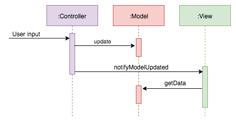

# Model-View-Controller (MVC)

**Model-View-Controller (MVC)** states that each class you write should be part of one of the following layers:

-   **Model**: The data classes that model your business belong to this layer. They usually contain data and business logic. This layer also contains the classes that fetch and create objects of those business classes, networking, caching and handling databases.
    
-   **View**: This layer displays data from the Model. It doesn’t contain any business logic.
    
-   **Controller**: The goal of this layer is to connect the objects of the Model and View layers. It gets notified of user interaction and updates the Model. It retrieves data from the Model. It may also update the View when there’s a change in the Model.
    

Ideally, you have separate layers to allow testing them separately.

The View knows about the Model, and the Controller has a reference to both the View and the Model.

Using MVC in Android
