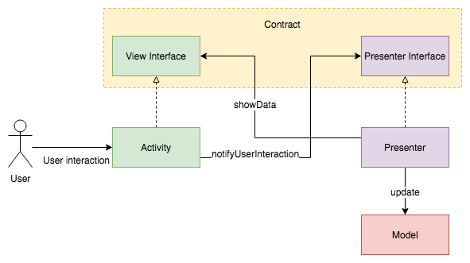

# Model-View-Presenter (MVP)

-   **Model**: This is the same as the Model layer from MVC.

-   **View**: Displays data presented by the Presenter but doesn’t have a reference to the Model. It does, however, have a reference to the Presenter to notify it about user actions.
    
	
-   **Presenter**: Similar to the Controller from the previous pattern, the Presenter retrieves data from the Model and updates it accordingly. It has UI presentation logic that decides what to display. It notifies the View when a Model has changed. Therefore, it has a reference to the View and the Model.

